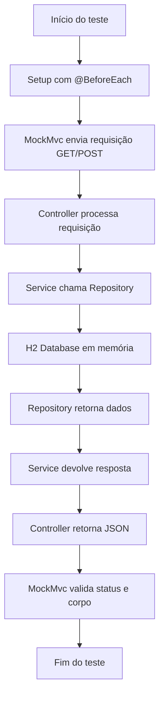

# 🧪 Teste de demostração Spring MockMVC 

Este projeto demonstra como realizar **testes simulando requisições HTTP sem subir um servidor real** usando **MockMvc** no Spring Boot.

## 📌 Objetivo
- Criar endpoints REST para gerenciar produtos.
- Usar `@AutoConfigureMockMvc` para injetar o objeto `MockMvc`.
- Simular requisições HTTP **GET** e **POST**.
- Validar **status**, **corpo** e **headers** da resposta.
- Garantir que os testes sejam executados em um banco **H2 em memória**.

---

## 📂 Estrutura do Projeto

```text
spring-mockmvc-testing-demo/
├── build.gradle.kts
├── src
│ ├── main
│ │ └── java/com/example/springmockmvctest
│ │ ├── SpringMockMvcTestingDemoApplication.java
│ │ ├── controller/ProductController.java
│ │ ├── entity/Product.java
│ │ ├── repository/ProductRepository.java
│ │ └── service/ProductService.java
│ └── test
│ └── java/com/example/springmockmvctest
│ └── ProductControllerMockMvcTest.java
└── src/main/resources/application.properties
```

---

## 🛠 Tecnologias Utilizadas
- **Java 21**
- **Spring Boot 3**
- **Spring Data JPA**
- **H2 Database**
- **MockMvc**
- **JUnit 5**

---

## 🔄 Fluxo de Teste com MockMvc




